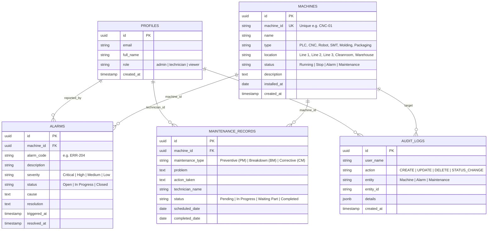

# 🏭 PLC Alarm & Maintenance Management System
> **PROGRAMMING IN AUTOMATION SYSTEMS**  
> งานพัฒนา Automation Web Application ด้วย AI  
> **Tech Stack:** Next.js (App Router, TypeScript) • Tailwind CSS • Supabase • GitHub • GitHub Actions • Vercel • AI

[](https://github.com/siriwat-kum-cmyk/PLC-WEB/actions/workflows/ci.yml)
[](https://plc-web-two.vercel.app)
[](https://nextjs.org)
[](https://supabase.com)

---

## 📌 1. ชื่อโครงการและวัตถุประสงค์ (Project Overview & Objectives)

**Alarm & Maintenance Management System** คือ เว็บแอปพลิเคชันเกรดอุตสาหกรรมสำหรับสนับสนุนงานด้าน Automation และการบริหารจัดการงานบำรุงรักษาเครื่องจักรในโรงงาน (Factory Machine Maintenance) เพื่อแก้ไขปัญหา Downtime และการสูญหายของประวัติการซ่อมบำรุง 

### วัตถุประสงค์หลัก:
1. **Machine Monitoring & Master Data**: ควบคุมทะเบียนเครื่องจักร รหัสเฉพาะ (Unique Machine ID) และติดตามสถานะจริง 4 สถานะมาตรฐาน (`Running`, `Stop`, `Alarm`, `Maintenance`)
2. **Alarm Incident Management**: แจ้งเตือนข้อผิดพลาด ตรวจสอบความรุนแรง (Severity: `Critical`, `High`, `Medium`, `Low`) และวงจรการแก้ไขตามลำดับ `Open` ➔ `In Progress` ➔ `Closed` พร้อมบันทึกสาเหตุ (Cause) และวิธีแก้ไข (Resolution)
3. **Maintenance Work Orders**: จัดการใบสั่งซ่อมบำรุงทั้ง 3 ประเภท (`Preventive PM`, `Breakdown BM`, `Corrective CM`) และรองรับสถานะ **`Waiting Part` (รอเบิกอะไหล่ - Change Request)**
4. **Real-time Industrial SCADA Dashboard**: แสดงตัวเลข KPI, สัดส่วนความพร้อมใช้งานของเครื่องจักร (Availability), กราฟแจกแจงความรุนแรงของ Alarm และงานซ่อมคงค้าง
5. **Machine History Lifecycle (Bonus / Change Request)**: หน้าเจาะลึกไทม์ไลน์ประวัติเครื่องจักรรายตัว (`/machines/[id]`)
6. **Multi-Role RBAC & Audit Trail**: ควบคุมสิทธิ์การเข้าถึงอย่างปลอดภัยระหว่าง `Admin`, `Technician` และ `Viewer (Bonus)` พร้อมเก็บบันทึก Audit Log ทุกความเคลื่อนไหว

---

## 🚀 2. ข้อมูลการส่งมอบและลิงก์โครงการ (Deliverables & Live URLs)

| รายการส่งมอบ | ลิงก์ / รายละเอียด |
| :--- | :--- |
| **1. GitHub Repository** | 🔗 [https://github.com/siriwat-kum-cmyk/PLC-WEB.git](https://github.com/siriwat-kum-cmyk/PLC-WEB.git) |
| **2. Vercel Deployment URL** | 🔗 [https://plc-web-two.vercel.app](https://plc-web-two.vercel.app) *(หรือ URL ที่ได้จากการ Import สู่ Vercel)* |
| **3. Supabase Schema Script** | 📄 [supabase/schema.sql](./supabase/schema.sql) และ [supabase/seed.sql](./supabase/seed.sql) |
| **4. เอกสารประกอบโครงการ** | 📄 [README.md](./README.md) |
| **5. คู่มือหน้าจอระบบ (Screenshots)** | มีคำอธิบายองค์ประกอบหน้าจอทุกหน้าครบถ้วนในหัวข้อที่ 5 |
| **6. รายงานการใช้ AI ในการพัฒนา** | บันทึกรายละเอียดในหัวข้อที่ 7 |

---

## 🏗️ 3. สถาปัตยกรรมระบบและฐานข้อมูล (Architecture & Database Schema)

ระบบออกแบบด้วยโครงสร้าง **Dual-Mode Data Architecture** รองรับการเชื่อมต่อฐานข้อมูลจริงผ่าน Supabase PostgreSQL และมีระบบ Demo In-Memory/LocalStorage Fallback ช่วยให้สามารถเปิดทดสอบและประเมินผลได้ทันทีโดยไม่มีปัญหาเรื่องการขาด Environment Variables

### Entity-Relationship Diagram (ERD):


---

## ⚡ 4. วิธีการติดตั้งและรันในเครื่อง (Installation & Setup Guide)

### สิ่งที่ต้องมีในเครื่อง (Prerequisites):
- Node.js version 18 หรือใหม่กว่า (แนะนำ Node.js 20+)
- Git

### ขั้นตอนการรัน:
```bash
# 1. Clone repository
git clone https://github.com/siriwat-kum-cmyk/PLC-WEB.git
cd PLC-WEB

# 2. ติดตั้ง Dependencies
npm install

# 3. ตั้งค่าตัวแปรสภาพแวดล้อม (ทางเลือก - หากมี Supabase)
cp .env.example .env.local
# แก้ไขค่า NEXT_PUBLIC_SUPABASE_URL และ NEXT_PUBLIC_SUPABASE_ANON_KEY

# 4. สั่งรัน Development Server
npm run dev
```
เปิดเบราว์เซอร์ที่ [http://localhost:3000](http://localhost:3000)

### การตั้งค่าฐานข้อมูลบน Supabase:
1. เข้าไปที่ [Supabase Dashboard](https://supabase.com/dashboard) ➔ สร้างโปรเจกต์ใหม่
2. เปิดเมนู **SQL Editor**
3. คัดลอกเนื้อหาจากไฟล์ `supabase/schema.sql` แล้วกด **Run**
4. คัดลอกเนื้อหาจากไฟล์ `supabase/seed.sql` แล้วกด **Run** เพื่อสร้างข้อมูลเริ่มต้นตัวอย่างโรงงาน

---

## 🖥️ 5. ภาพรวมหน้าจอและฟังก์ชันการทำงาน (Screenshots & Features)

### 1. หน้าเข้าสู่ระบบ (Login & Demo Switcher): `/login`
- รองรับการล็อกอินผ่าน Supabase Auth
- มีปุ่ม **Quick Demo Login (1-Click)** สำหรับอาจารย์และผู้ตรวจ:
  - 🔴 **Admin**: สิทธิ์เต็ม จัดการเครื่องจักร, ปิด Alarm, มอบหมายงานซ่อม, ดู Audit Log
  - 🟡 **Technician**: สิทธิ์ช่างซ่อม ดูเครื่องจักร, อัปเดตสถานะ Alarm, เปิด/แก้ไขงานซ่อมบำรุง
  - 🔵 **Viewer (Bonus)**: ดูภาพรวมและสถิติแบบ Read-Only

### 2. หน้าแดชบอร์ดอุตสาหกรรม (SCADA Dashboard): `/dashboard`
- **KPI Metrics Cards**: จำนวนเครื่องจักรทั้งหมด, อัตราส่วนความพร้อมใช้งาน (Availability %), จำนวนเครื่อง Running, Stop, Alarm (ไฟกระพริบเตือนสีแดง), และ Maintenance
- **กราฟวิเคราะห์ (Recharts)**:
  1. กราฟวงกลมแจกแจงสถานะเครื่องจักร (Machine Status Distribution)
  2. กราฟแท่งวิเคราะห์ความรุนแรงของ Alarm (Alarms by Severity - Bonus)
  3. กราฟแท่งจำแนกประเภทงานซ่อมบำรุง (PM, BM, CM)
- **Active Incidents Feed**: ตารางสรุปสัญญาณเตือนที่ยังเปิดอยู่ และงานซ่อมบำรุงที่กำลังดำเนินการ

### 3. ทะเบียนเครื่องจักร (Machine Master): `/machines`
- บันทึก Machine ID (มี Validation ป้องกันรหัสซ้ำอย่างเคร่งครัด), ชื่อ, ชนิดเครื่องจักร, สถานที่ติดตั้ง, และสถานะ
- **Multi-Filter**: ค้นหาพร้อมกันได้หลายเงื่อนไข (ข้อความค้นหา + กรองสถานะ + กรองสถานที่)
- ลิงก์ตรงสู่หน้า **Machine History** ของเครื่องจักรแต่ละเครื่อง

### 4. ประวัติไทม์ไลน์เครื่องจักร (Machine History Timeline - Bonus & CR): `/machines/[id]`
- แสดงข้อมูลสเปกเครื่องจักรโดยละเอียด
- **Unified Event Timeline**: รวมประวัติสัญญาณเตือน (Alarms) และประวัติงานซ่อมบำรุง (Maintenance) ของเครื่องจักรนั้นๆ แบบไทม์ไลน์ตามลำดับเวลา เพื่อดูประวัติการซ่อมและประเมินสุขภาพเครื่องจักร

### 5. ระบบจัดการสัญญาณเตือน (Alarm Incident Management): `/alarms`
- บันทึกรหัส Alarm Code, เครื่องจักร, รายละเอียด, ระดับความรุนแรง Critical/High/Medium/Low
- ปรับเปลี่ยนสถานะตามวงจร `Open` ➔ `In Progress` ➔ `Closed`
- มีระบบบังคับระบุ **Root Cause (สาเหตุ)** และ **Resolution (วิธีแก้ไข)** ก่อนปิดงาน
- เมื่อมี Alarm เกิดขึ้น สถานะเครื่องจักรจะเปลี่ยนเป็น `Alarm` อัตโนมัติ และเมื่อปิด Alarm ครบทุกตัว เครื่องจักรจะคืนสู่สถานะปกติ

### 6. ระบบใบสั่งซ่อมบำรุง (Maintenance Work Orders): `/maintenance`
- รองรับงาน PM (เชิงป้องกัน), BM (ซ่อมด่วน), CM (ปรับปรุงแก้ไข)
- รองรับสถานะ **`Waiting Part` (รอเบิกอะไหล่ - Change Request)** พร้อมระบุรายการอะไหล่ที่รอ
- ตัวกรองขั้นสูงตามเครื่องจักร, ประเภทงาน, สถานะ และ **ตัวกรองตามช่วงวันที่ (Date Filter - Change Request)**

### 7. ประวัติการตรวจสอบระบบ (Audit Logs - Bonus): `/audit-logs`
- บันทึกทุกความเคลื่อนไหว: ใครทำอะไร, ที่ Entity ใด, เวลาใด พร้อมข้อมูล JSON snapshot รายละเอียด

### 8. ส่งออกข้อมูล (CSV / Excel Export - Bonus): `/reports`
- ดาวน์โหลด Machine Master, Alarms History, และ Maintenance Records เป็นไฟล์ `.csv` (เข้ารหัส UTF-8 BOM รองรับภาษาไทยใน Microsoft Excel ได้ 100%)

---

## 🤖 6. รายงานการใช้ AI ในการพัฒนา (AI Development Report)

การพัฒนาโปรเจกต์นี้ใช้ความสามารถของ **AI Pair Programming (Google DeepMind Antigravity & LLM)** ในทุกมิติตามที่ระบุในข้อกำหนด:

1. **การวิเคราะห์ความต้องการ (Requirement Analysis)**:
   - สกัดเงื่อนไขเกณฑ์คะแนน (100 คะแนนเต็ม + 10 คะแนนโบนัส + Change Requests) สู่ Requirement Compliance Matrix
2. **การออกแบบสถาปัตยกรรมและฐานข้อมูล (Architecture & SQL DDL)**:
   - ออกแบบตาราง `profiles`, `machines`, `alarms`, `maintenance_records`, `audit_logs` พร้อม Constraints (ห้าม Machine ID ซ้ำ), Foreign Keys, และ Row Level Security (RLS) policies
   - จัดเตรียม Seed Data เครื่องจักรโรงงานเสมือนจริง เช่น KUKA Robotic Welder, 5-Axis CNC, Mitsubishi PLC Conveyor
3. **การสร้างโค้ดและ UI/UX (Frontend & Styling)**:
   - พัฒนาเว็บด้วย Next.js 15 App Router และ TypeScript แบบ Modular
   - ออกแบบ UI สไตล์ SCADA/Industrial Dashboard โดยใช้ Tailwind CSS พร้อม Dark/Light Mode Switch และสีมาตรฐานโรงงาน
4. **การตรวจสอบและป้องกันข้อผิดพลาด (Validation & Safeguards)**:
   - สร้าง Input Validation ตรวจสอบความถูกต้องของข้อมูล ป้องกันการกรอกข้อมูลว่าง และเช็ค Duplicate Machine ID
5. **DevOps & CI/CD Pipeline**:
   - ออกแบบ GitHub Actions Workflow (`.github/workflows/ci.yml`) ตรวจสอบ Dependencies, TypeScript Type-checking, Linting, และ Production Build อัตโนมัติทุกครั้งที่มีการ Push โค้ดขึ้น GitHub

---

## 🧪 7. การตรวจสอบคุณภาพ (Verification & Testing)

คำสั่งที่ใช้ในการทดสอบระบบ:
```bash
# 1. ตรวจสอบไวยากรณ์ TypeScript
npm run type-check

# 2. ตรวจสอบ Lint มาตรฐาน Next.js
npm run lint

# 3. ตรวจสอบการ Build สำหรับ Production
npm run build
```

---

## 👨‍💻 ข้อมูลผู้พัฒนา & หลักสูตร
- **วิชา**: Programming in Automation Systems
- **สถาบัน**: สาขาวิชาวิศวกรรมระบบอัตโนมัติ / เมคาทรอนิกส์
- **ปีการศึกษา**: 2569 (2026)
