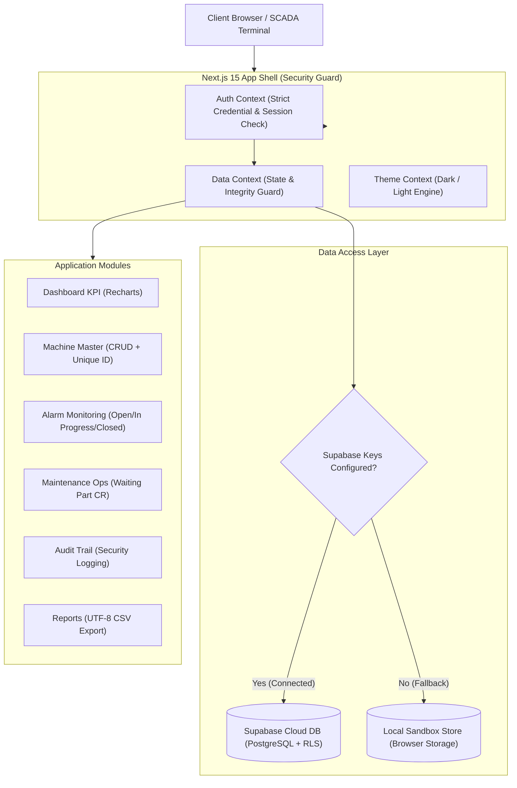

# SCADA Alarm & Maintenance Management System

> ระบบบริหารจัดการเหตุการณ์แจ้งเตือนและงานซ่อมบำรุงรักษาเครื่องจักรในสายการผลิตอุตสาหกรรม (Industrial Smart Factory SCADA Operations) พัฒนาด้วย Next.js 15 App Router, TypeScript, Tailwind CSS, Supabase, Recharts และ GitHub Actions CI/CD

---

## 1. Project Overview (ภาพรวมโครงการ)

ระบบ **SCADA Alarm & Maintenance Management System** ออกแบบและพัฒนาขึ้นเพื่อทำหน้าที่เป็นศูนย์กลางการเฝ้าระวัง ควบคุม และบริหารจัดการเครื่องจักรในสายการผลิต (Machine Master), ติดตามเหตุการณ์แจ้งเตือนข้อผิดพลาด (Alarm Incidents Monitoring), และวางแผนดำเนินการงานซ่อมบำรุงรักษาเชิงป้องกันและแก้ไข (Preventive & Corrective Maintenance Operations)

ระบบเชื่อมต่อกับระบบควบคุมอัตโนมัติ (PLC / Industrial Protocols เช่น Modbus TCP, EtherNet/IP, Profinet) พร้อมระบบความปลอดภัยและการควบคุมสิทธิ์การเข้าถึงข้อมูลตามบทบาท (Role-Based Access Control - RBAC) และสถาปัตยกรรมข้อมูลแบบไฮบริด (Dual-Mode Data Architecture) ที่ทำงานได้ทั้งแบบเชื่อมต่อฐานข้อมูล Supabase สดบน Cloud และโหมด Local Sandbox สำหรับการทดสอบออฟไลน์ 100%

---

## 2. Key Objectives (วัตถุประสงค์หลัก)

1. **Operational Continuity**: ลดเวลาหยุดทำงานของเครื่องจักร (Downtime) ด้วยการแจ้งเตือนแบบเรียลไทม์และการวิเคราะห์สาเหตุเชิงลึก
2. **Data Integrity & Traceability**: รักษาวงจรข้อมูลตามมาตรฐานวิศวกรรม (ON DELETE RESTRICT) เพื่อไม่ให้ประวัติ Alarm หรือ Maintenance สูญหายเมื่อเครื่องจักรมีการปรับปรุง
3. **Strict Security & RBAC**: บังคับใช้นโยบายตรวจสอบสิทธิ์เข้มงวด ป้องกันการลักลอบเข้าถึงหน้าภายในระบบ และแบ่งแยกหน้าที่ระหว่าง Admin, Technician และ Viewer อย่างเด็ดขาด
4. **Maintenance Optimization**: รองรับกระบวนการขอเบิกอะไหล่ (Waiting Part Change Request) เพื่อความคล่องตัวในการจัดซื้อและควบคุมสต็อกอะไหล่
5. **Modern Engineering Standards**: Zero-defect TypeScript, ESLint, Automated Testing และ GitHub Actions CI/CD Pipeline

---

## 3. System Architecture & Dual-Mode Flow



---

## 4. User Roles & Permission Matrix (การควบคุมสิทธิ์ตามบทบาท)

ระบบแบ่งบทบาทผู้ใช้งานออกเป็น 3 ระดับ พร้อมการบังคับใช้สิทธิ์ทั้งในระดับ UI, Client Route Guard (`AppShell`), และ Database Row Level Security (RLS):

| สิทธิ์และฟังก์ชันการใช้งาน | Admin (ผู้ดูแลระบบ) | Technician (ช่างเทคนิค) | Viewer (ผู้สังเกตการณ์) |
|---|:---:|:---:|:---:|
| เข้าสู่ระบบและออกจากระบบ (Login/Logout) | ✅ | ✅ | ✅ |
| ดู Dashboard และสถิติ KPI รวม | ✅ | ✅ | ✅ |
| ดูรายการและประวัติเครื่องจักร (Machine History) | ✅ | ✅ | ✅ |
| เพิ่ม / แก้ไข / ลบ เครื่องจักร (Machine Master CRUD) | ✅ | ❌ | ❌ |
| ดูรายการและรายละเอียด Alarm Incidents | ✅ | ✅ | ✅ |
| เพิ่ม Alarm Incident ใหม่ | ✅ | ✅ | ❌ |
| ปรับเปลี่ยนสถานะ Alarm (Open &rarr; In Progress &rarr; Closed) | ✅ | ✅ | ❌ |
| แก้ไขสเปกหรือลบ Alarm | ✅ | ❌ | ❌ |
| ดูรายการและประวัติการซ่อมบำรุง (Maintenance Logs) | ✅ | ✅ | ✅ |
| เพิ่ม / บันทึกการปฏิบัติงานซ่อมบำรุงรักษา | ✅ | ✅ | ❌ |
| ร้องขอเบิกอะไหล่ (Waiting Part Change Request) | ✅ | ✅ | ❌ |
| แก้ไขบันทึกงานซ่อมบำรุงที่ตนเองปฏิบัติงาน | ✅ | ✅ | ❌ |
| ลบประวัติงานซ่อมบำรุง | ✅ | ❌ | ❌ |
| ดูบันทึกกิจกรรมความปลอดภัย (Audit Logs) | ✅ | ❌ | ❌ |
| ส่งออกข้อมูลรายงาน (Export CSV) | ✅ | ✅ | ✅ |

### บัญชีทดสอบระบบ (Authorized Demo Credentials)

> [!IMPORTANT]
> ระบบตรวจสอบสิทธิ์อย่างเข้มงวด (Strict Authentication) โดยจะปฏิเสธรหัสผ่านที่ไม่ถูกต้องหรืออีเมลที่ไม่ได้ลงทะเบียนในระบบโดยอัตโนมัติ

* **Admin Account**: `admin@automation.local` | รหัสผ่าน: `admin123`
* **Technician Account**: `tech@automation.local` | รหัสผ่าน: `tech123`
* **Viewer Account**: `viewer@automation.local` | รหัสผ่าน: `viewer123`

---

## 5. Technology Stack

* **Frontend Framework**: Next.js 15.5.26 (Patched against CVE-2025-66478, App Router, Server & Client Components)
* **Core Library**: React 19.0.0
* **Styling & Design System**: Tailwind CSS 3.4.17 with SCADA industrial theme & custom Dark/Light Mode plugin
* **Programming Language**: TypeScript 5.8.2 (Strict type checking, zero `any`)
* **Iconography**: Lucide React
* **Data Visualization**: Recharts (Pie/Donut Charts, Responsive Bar Charts)
* **Database & Auth**: Supabase PostgreSQL 15 with Row Level Security (RLS) & Triggers
* **Testing & Quality**: Node Test Runner, TypeScript Compiler (`tsc --noEmit`), ESLint 9
* **CI/CD Automation**: GitHub Actions (`.github/workflows/ci.yml`)
* **Hosting Platform**: Vercel

---

## 6. Project Structure

```text
PLC-web/
├── .github/
│   └── workflows/
│       └── ci.yml               # GitHub Actions CI workflow (lint, typecheck, test, build)
├── docs/
│   ├── SYSTEM_DESIGN.md         # Comprehensive System Architecture & Engineering Decisions
│   ├── AI_DEVELOPMENT_LOG.md    # Transparent record of autonomous AI pair-programming
│   ├── User_Manual_Alarm_Maintenance_System.pdf # Comprehensive User Guide
│   └── Presentation_Alarm_Maintenance_System.pdf # 16:9 Presentation Slides
├── public/                      # Static assets & icons
├── src/
│   ├── app/
│   │   ├── globals.css          # Tailwind CSS styles & industrial color tokens
│   │   ├── layout.tsx           # Global root layout with Providers
│   │   ├── page.tsx             # Root router redirecting to /dashboard or /login
│   │   ├── login/page.tsx       # SCADA Security Portal with demo quick-select pills
│   │   ├── dashboard/page.tsx   # SCADA KPI Dashboard with 7 metrics & Recharts
│   │   ├── machines/
│   │   │   ├── page.tsx         # Machine Master list with search & multi-filtering
│   │   │   └── [id]/page.tsx    # Machine History Timeline (merged alarms & maintenance)
│   │   ├── alarms/page.tsx      # Alarm Monitor with status transitions
│   │   ├── maintenance/page.tsx # Maintenance Operations with Waiting Part CR
│   │   ├── audit-logs/page.tsx  # System Audit Trail (Admin only)
│   │   └── reports/page.tsx     # UTF-8 BOM CSV Data Export Center
│   ├── components/
│   │   ├── common/              # StatusBadge, SeverityBadge, ConfirmModal, StatCard
│   │   ├── layout/              # AppShell, Header, Sidebar
│   │   ├── machines/            # MachineModal (Add/Edit with duplicate check)
│   │   ├── alarms/              # AlarmModal, StatusUpdateModal
│   │   ├── maintenance/         # MaintenanceModal (Waiting Part CR)
│   │   └── dashboard/           # DashboardCharts (Donut & Bar charts)
│   ├── context/
│   │   ├── auth-context.tsx     # Strict credential verification & RBAC context
│   │   ├── data-context.tsx     # Dual-mode state provider & data integrity guards
│   │   └── theme-context.tsx    # Dark / Light mode context
│   ├── lib/
│   │   ├── mock-data.ts         # High-fidelity industrial seed data
│   │   ├── utils.ts             # Date formatters, classnames merger, color helpers
│   │   └── supabase/client.ts   # Supabase client singleton with environment detector
│   └── types/
│       └── index.ts             # TypeScript interfaces, enums, and data models
├── supabase/
│   ├── schema.sql               # Full DDL: tables, indexes, triggers, RLS policies
│   └── seed.sql                 # Industrial test dataset
├── tests/
│   └── validation.test.mjs      # Automated unit tests for auth, CRUD, and KPI logic
├── .env.example                 # Example environment variables template
├── next.config.ts               # Next.js configuration
├── package.json                 # Project dependencies & scripts
├── tailwind.config.ts           # Tailwind CSS theme configuration
├── tsconfig.json                # TypeScript compiler configuration
└── vercel.json                  # Vercel deployment configuration
```

---

## 7. Installation & Getting Started

### ข้อกำหนดเบื้องต้น (Prerequisites)

* Node.js v20.x หรือ v22.x หรือ v25.x
* npm (Node Package Manager)

### ขั้นตอนการติดตั้งและรันในเครื่อง (Local Setup)

```bash
# 1. โคลน Repository
git clone https://github.com/siriwat-kum-cmyk/PLC-WEB.git
cd PLC-WEB

# 2. ติดตั้ง Dependencies
npm install

# 3. กำหนดค่า Environment Variables (ทางเลือก)
cp .env.example .env.local

# 4. ทดสอบความถูกต้องของระบบ
npm run test
npm run type-check
npm run lint

# 5. รัน Development Server
npm run dev
```

เปิดเว็บเบราว์เซอร์ไปที่ `http://localhost:3000` ระบบจะนำทางไปยังหน้า `/login` อัตโนมัติ

---

## 8. Available Development Scripts

* `npm run dev`: เริ่มต้นเซิร์ฟเวอร์สำหรับการพัฒนา (Next.js Dev Server)
* `npm run build`: คอมไพล์และสร้างโค้ดสำหรับ Production (Next.js Build)
* `npm run start`: รันเซิร์ฟเวอร์ Production หลังจาก Build เสร็จ
* `npm run lint`: ตรวจสอบคุณภาพโค้ดและมาตรฐานตาม ESLint
* `npm run type-check`: ตรวจสอบความถูกต้องของ Type ทั้งหมดด้วย TypeScript Compiler
* `npm run test`: รัน Automated System Validation Tests ทั้ง 5 ชุด

---

## 9. Database Setup & Supabase Configuration

ระบบถูกออกแบบมาพร้อมสคริปต์ SQL ที่สมบูรณ์แบบในโฟลเดอร์ `supabase/`:

1. **`supabase/schema.sql`**: สร้างตาราง `profiles`, `machines`, `alarms`, `maintenance_records`, `audit_logs` พร้อม Trigger คำนวณ `updated_at`, ฟังก์ชัน Foreign Key Integrity, และนโยบายความปลอดภัย Row Level Security (RLS)
2. **`supabase/seed.sql`**: บันทึกข้อมูลจำลองมาตรฐานอุตสาหกรรมสำหรับทดสอบระบบ

### การตั้งค่าใน Supabase Console

1. สร้างโปรเจกต์ใหม่ใน [Supabase Dashboard](https://supabase.com)
2. ไปที่ **SQL Editor** &rarr; รันสคริปต์ `supabase/schema.sql`
3. รันสคริปต์ `supabase/seed.sql`
4. คัดลอกค่า **Project URL** และ **Anon Key** จากแถบ Project Settings &rarr; API
5. นำค่ามากรอกใน `.env.local` หรือ Environment Variables บน Vercel:

```env
NEXT_PUBLIC_SUPABASE_URL=https://your-project.supabase.co
NEXT_PUBLIC_SUPABASE_ANON_KEY=your-anon-key-here
```

---

## 10. Continuous Integration & Quality Assurance (CI/CD)

ระบบใช้ **GitHub Actions** ตรวจสอบคุณภาพโค้ดอัตโนมัติทุกครั้งที่มีการ Push หรือสร้าง Pull Request ไปยังกิ่ง `main`:

```yaml
steps:
  - Install Dependencies (npm install)
  - Run Automated Validation Tests (npm run test)
  - TypeScript Type Check (npm run type-check)
  - ESLint Inspection (npm run lint)
  - Production Build (npm run build)
```

---

## 11. Known Limitations & Future Improvements

1. **Physical PLC Hardware Protocol**: ปัจจุบันระบบจำลองสถานะการเชื่อมต่อ Modbus TCP และ I/O ผ่าน Web Socket และ Simulation Engine ในอนาคตสามารถเชื่อมต่อกับ Edge Gateway โดยตรงผ่าน OPC UA Client Node
2. **Mobile Push Notifications**: ปัจจุบันระบบใช้ UI Badge และ Toast Alert สามารถต่อยอดด้วย Web Push Notification ผ่าน Service Worker
3. **Advanced Predictive Maintenance**: สามารถเชื่อมต่อโมเดล Machine Learning เพื่อทำนายอายุการใช้งานที่เหลืออยู่ (Remaining Useful Life - RUL) ของมอเตอร์และตลับลูกปืน

---

## 12. Author & Acknowledgements

* **Developer**: Industrial Automation & Software Engineering Team
* **AI Pair Programming**: Developed in collaboration with Google DeepMind Antigravity AI
* **License**: MIT
